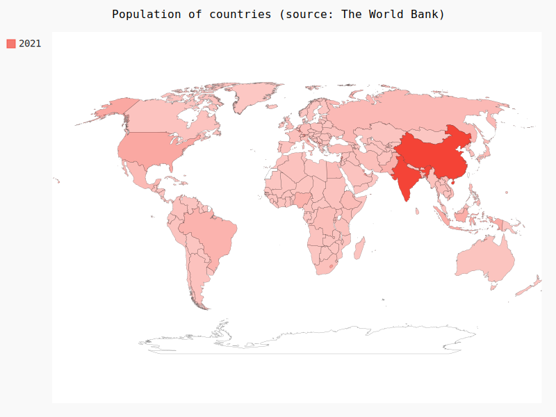

# World map of Population

In this small project, I (will)

- [x] Get the data of populaton from Web
- [x] Keep the data in memory
- [x] Analyze the data
- [x] Show the populaton of countries onto the world map

